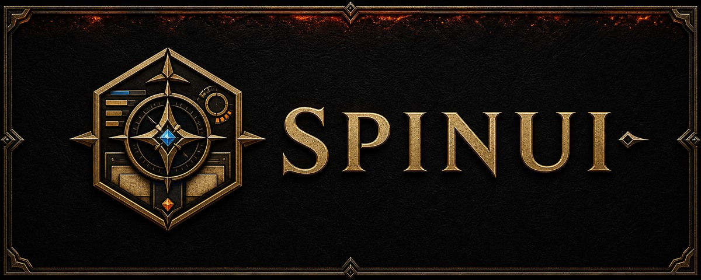
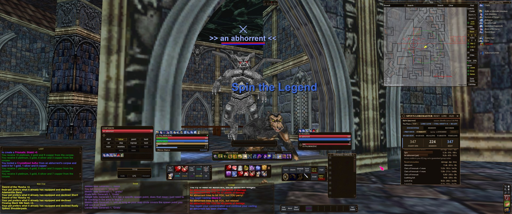
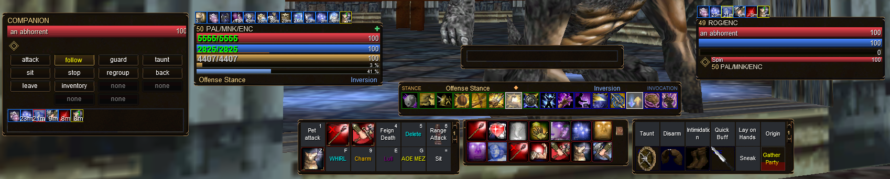
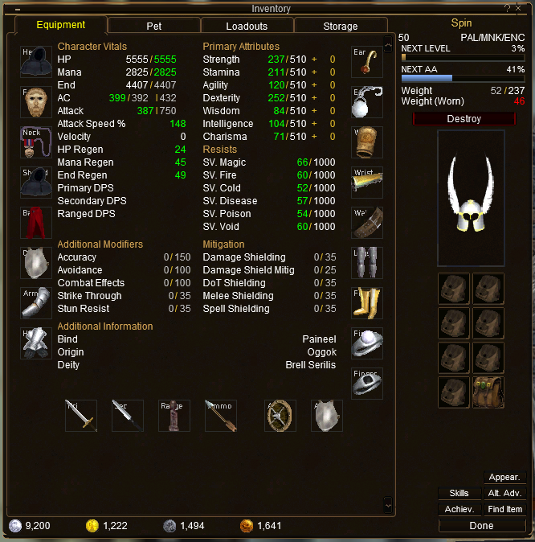
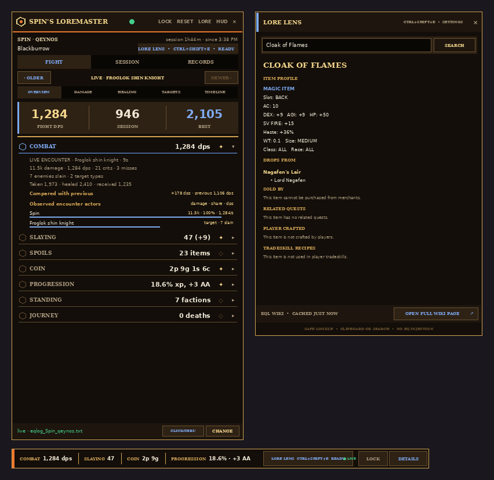
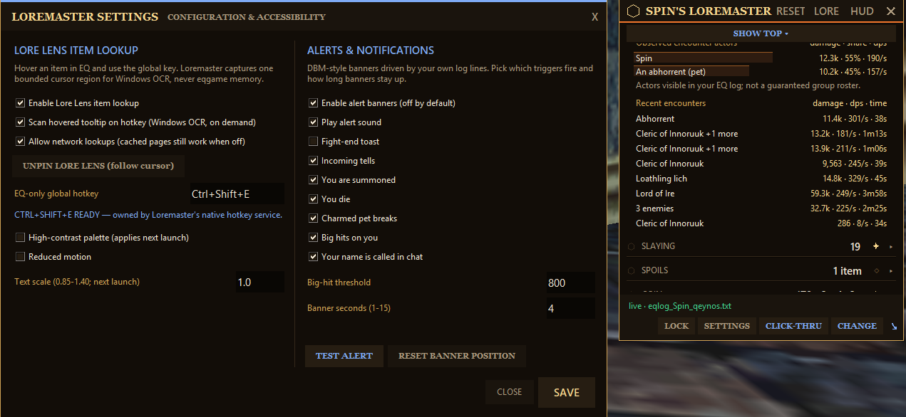
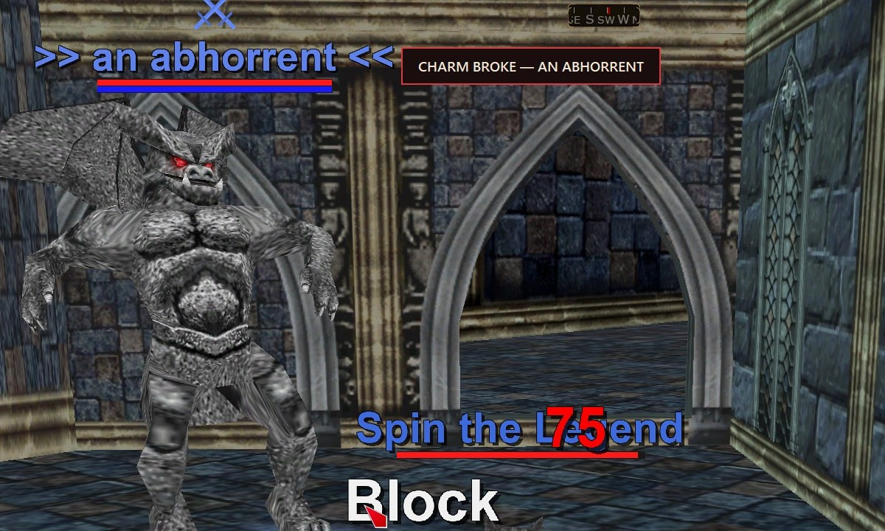

<p align="center">
  
</p>

<h1 align="center">SpinUI + Spin's Loremaster</h1>

<p align="center"><strong>See more of Norrath. Read every fight.</strong></p>

<p align="center">
  A complete Vellum &amp; Ember interface for EverQuest Legends—built around a clear combat cockpit and paired with a log-driven encounter lab, adventure ledger, item companion, and alert system.
</p>

<p align="center">
  <a href="https://github.com/itsspin/spinips/releases/latest"><strong>Download the latest release</strong></a>
  · <a href="#quick-start">Quick start</a>
  · <a href="#spins-loremaster">Explore Loremaster</a>
  · <a href="#layout-profiles">Choose a layout</a>
</p>

<p align="center">
  Windows · 7 validated resolutions · 21 generated layout profiles · Packaged app needs no Python · No injection or game-memory access
</p>

> [!NOTE]
> SpinUI is an independent community project for EverQuest Legends and is not affiliated with or endorsed by Daybreak Game Company.

## The complete system, live

[](docs/screenshots/spinui-gameplay-overview.jpg)

<p align="center"><em>SpinUI in live play: a clear world view, centered combat controls, focused chat lanes, and Loremaster alongside the game.</em></p>

| SpinUI | Layout profiles | Spin's Loremaster |
|---|---|---|
| Shared chrome gives native windows one leather, brass, ember, and spirit-blue visual language. | Seven resolutions and three play styles, generated and checked in all 21 combinations. | Live combat, progression, loot, travel, Lore Lens, and alerts from ordinary EQ logs plus one-shot, user-triggered screen OCR. |

SpinUI is more than a recolor. It re-composes EverQuest's native XML, textures, and layout data into a single cockpit: the world stays open, the combat loop stays on one eye-line, and information appears where it earns the space.

## The HUD, rebuilt around the fight

[](docs/screenshots/spinui-combat-hud-detail.png)

<p align="center"><em>One-glance combat: pet commands, vitals, stance, spell gems, hotbuttons, and target status without covering the fight.</em></p>

- **One centered eye-line.** Player, target, casting, stance, spell gems, and actions share a bottom-anchored combat band instead of competing with the center of the world.
- **Information has a color grammar.** HP is red, mana is blue, endurance and XP are brass gold, and AA is spirit blue. XP and AA keep persistent tick marks while their fills remain correctly scaled to the displayed percentage.
- **Native controls stay native.** Hotbuttons, spell gems, pet commands, drag/drop, tooltips, loadouts, and client-driven usable/unusable states retain their original bindings.
- **The spell deck adapts to the player.** Its default remains the compact icon-only deck; choose **Display Types -> SpinUI Spell Ledger** for a resizable alternate with every icon, live spell name, and memorized slot number.
- **Effects read through the artwork.** Spell, song, and pet-effect durations sit directly on their icons in shadowed ember gold instead of growing into opaque timer slabs.
- **Key HUD, chat, and map windows get lighter when they are not the focus.** Translucency and soft fade behavior reduce visual weight without hiding the information you deliberately placed.
- **The shape is deliberate at every resolution.** SpinUI recalculates docks and spacing instead of blanket-scaling text and click targets into blur.

## Inventory becomes a character sheet

<p align="center">
  <a href="docs/screenshots/spinui-inventory-equipment.png">
    
  </a>
</p>

<p align="center"><em>A complete character sheet inside the inventory—equipment, vitals, attributes, resistances, identity, currencies, and bags in one coherent panel.</em></p>

The compact **660×668 Equipment tab** preserves all **23 native equipment slots** while turning the stock window into a readable character sheet:

- Character Vitals, Primary Attributes, Resists, Additional Modifiers, and Mitigation are grouped semantically rather than scattered around decorative empty space.
- Armor, jewelry, weapons, ammo, and both Any slots remain native equipment wells with their original ScreenID and EQType behavior.
- The class crest remains the functional drop-to-auto-equip target; the bag grid, currencies, stock buttons, drag/drop, and tooltips remain client-driven.
- Multiclass Loadouts use the same compact canvas while preserving the current Legends bindings, swap indicators, and allow/deny states.

## Spin's Loremaster

Loremaster turns the text log EverQuest already writes into a live **Adventurer's Chronicle**. It understands encounters, pets, charmed creatures, healing, progression, loot, factions, and travel, then presents them in a movable companion that looks like part of SpinUI—not a generic meter pasted over it.

[](docs/previews/loremaster_panel.png)

<p align="center"><em>Quiet in play, rich on demand: the Rune Seed unfolds into the complete parser, ledger, alert controls, and Lore Lens.</em></p>

[](docs/screenshots/loremaster-settings-and-hud.png)

<p align="center"><em>The full settings surface remains available for alert thresholds, sound, accessibility, Lore Lens, and advanced trigger choices.</em></p>

| Capability | What Loremaster does |
|---|---|
| **Encounter Lab** | Encounter, Session, and Records views with multi-enemy pulls plus actor, ability, healing, target, and a timeline grouped into two-second buckets. |
| **Adventure ledger** | XP/hour, time to level, kills, loot, all ten mote grades, coin and plat/hour, factions, skills, zones, and a bounded death recap. |
| **Pets and charms** | Credits summoned pets and conservatively claimed charmed creatures; same-name charm totals are included but clearly labeled as estimates when the text log cannot distinguish actor IDs. |
| **Mez control** | Starts a sleek target countdown only after your own recognized mez actually lands. Ranked durations use EQL's whole-tick scaling; identical mob names group honestly, and `LAST TICK` exposes the server-tick uncertainty instead of inventing an exact wake-up second. |
| **Rune Seed HUD** | A rounded 92×48 combat capsule pairs the generated SpinUI brass cog with a separate, overlap-free DPS lane. DPS is its only seeded metric; players can deliberately star up to four ledger cards to create a scrollable wheel. LIVE, READY, STALE, and ALERT use restrained trim motion; click to morph into the full parser, drag when unlocked, or right-click for settings. |
| **Lore Lens** | One-shot hovered-item OCR, exact EQL Wiki validation, cached results, and a configurable `Ctrl+Shift+E` shortcut. |
| **Alerts** | Opt-in banners and sound for tells, summons, deaths, charm breaks, big hits, name calls, and fight completion. Compact banners stay beside the Rune Seed with edge-safe Auto, Right, Left, Above, and Below placement choices. |
| **Character continuity** | Follows standard `eqlog_*.txt` activity and supports manual log-folder selection. Packaged builds store selected records and settings under `%LOCALAPPDATA%\SpinsLoremaster`; source runs keep state beside `loremaster.py`. |

### Charm intelligence that respects the log

[](docs/screenshots/loremaster-charm-break-alert.jpg)

<p align="center"><em>When alerts are enabled, a proven charm break ignites the Rune Seed and raises a short adjacent danger toast with optional sound while the encounter remains visible.</em></p>

Loremaster does not claim every nearby creature as yours. Ownership comes from owner-only pet chatter or a known charm landing shortly after your cast. A charm-break alert fires once only when a positively claimed active charm receives a recognized charm-spell fade. Zoning, player or pet death, intentional replacement, a wrong target, and duplicate fade lines stay silent.

The global alert switch ships **off**. The **Charmed pet breaks** and **Play alert sound** preferences are ready by default, so enabling alerts is enough to activate the warning; each can still be disabled independently.

### Mez timing without fake precision

Loremaster recognizes the Enchanter mez line plus supported Bard and Necromancer control songs/spells directly from the normal EQ text log. A cast alone never starts a timer: the target-specific success line must follow your own recent cast. Fizzles, interrupts, single-target resists, fades, overwrites, damage breaks, deaths, zoning, character changes, and reset all close the appropriate state. AE mez keeps accepting interleaved successes even when another target resists. If a nearby caster overlaps a spell that shares the same actorless landing message, Loremaster quarantines the ambiguous result instead of double-counting it as yours.

EQ applies spell durations in six-second server ticks, but the log does not reveal the tick phase. Loremaster therefore counts down the duration that is guaranteed safe, then shows **LAST TICK** until the fade arrives or the final possible tick passes. Same-named enemies appear as `×N` with the earliest deadline. The timer stack stays at three rows plus an overflow count, follows the Rune Seed or expanded HUD, never takes keyboard focus, and is click-through during play. Visual timers are enabled by default; the one-shot warning sound is optional in **Settings → Crowd Control Timers**.

### An honest encounter model

- Your first action—or an owned pet's first action—opens a fight. Ten seconds of true combat silence closes it.
- Nearby activity can extend an active fight only within a 20-second grace window of your own last action, so tagging one mob does not inherit an entire camp's timeline.
- Actor rows are observational. EverQuest logs what your client can see; they are not presented as a guaranteed group or raid roster.
- Same-named charmed-pet damage is included as an explicit estimate because the text log has no actor IDs.
- Session mode aggregates the current launch or manual reset, starts fresh on character switch, and can optionally reset after a configured idle period. Records deliberately preserve only durable character records instead of pretending volatile damage, coin, or XP totals are meaningful lifetime statistics.

### Lore Lens: item intelligence on demand

Hover an item and press **Ctrl+Shift+E** by default. Lore Lens freezes one bounded region around the cursor, runs Windows OCR after the keypress, ranks up to four likely titles, and validates them against exact [EQL Wiki](https://eqlwiki.com/) pages.

- No continuous capture, no injection, and no game-memory reading.
- Conservative `m` ↔ `rn` ambiguity repair can resolve compact-font mistakes such as `Camal` → `Carnal`, but only when the repaired title reaches an exact item page.
- Typed names, copied EQ item links, bracketed item names, and EQL Wiki URLs remain available as explicit fallbacks.
- Results can include item profile data, drops, vendors, quests, crafted status, and recipes. Empty sections remain honest instead of being guessed.
- Pages are cached for seven days by default. The UI distinguishes **LIVE**, **CACHED**, **STALE CACHE**, offline, and no-exact-match states.
- Ordinary clipboard text is never transmitted automatically; it only prefills the search field for confirmation.

## What makes SpinUI different

| Principle | In practice |
|---|---|
| **One visual language** | Oiled leather, aged brass, ember seams, parchment text, and restrained spirit blue carry from bags and inventory to the map and Loremaster. |
| **Native at the core** | SpinUI is SIDL XML, TGA textures, and INI layout data. It does not replace the client or trade away native behavior for a screenshot. |
| **A cockpit, not a collage** | Combat information shares one lower eye-line while the middle of the screen remains available for positioning and awareness. |
| **Resolution-aware** | Native controls stay crisp because each profile is recomputed instead of globally scaled. |
| **Adventure-aware** | Loremaster treats combat, progression, loot, travel, and item research as one journey rather than isolated utilities. |
| **Built to be changed** | Textures, layouts, inventory, pet controls, and previews come from rerunnable generators with audits and release gates. |

### Vellum & Ember

| Role | Palette | Applied to |
|---|---|---|
| Oiled leather | `#0C0906 → #2E2215` | window backgrounds, slots, and control layers |
| Brass frame | `#685030` / `#A68252` | outlines, button frames, and content wells |
| Ember seam | `#F2762C` | titlebars, interaction heat, and alert energy |
| Aged brass gold | `#D0A254` / `#F8D68C` | committed states, XP, records, and heraldic identity |
| Spirit blue | `#7EAAF4` | AA, casting, selection, and arcane accents |
| Parchment | `#F1E7D4` / `#AC9A7E` | primary and secondary text |

Every shared chrome texture is generated from the same palette. Dedicated core-window XML then adds readable gauges, effect rows, stat groupings, and control geometry without turning the rest of the interface into a different product.

## Layout profiles

SpinUI ships seven explicit screen profiles:

`1920×1080` · `2048×1080` · `2560×1080` · `2560×1440` · `3440×1440` · `3840×1600` · `3840×2160`

Each resolution includes three play styles:

| Preset | Emphasis | 3440×1440 chat row |
|---|---|---|
| **Combat Focus** *(default preset)* | Larger combat lane | Main 700px · Social 700px · Combat 1060px |
| **Social Focus** | Raid, guild, and group conversation | Main 620px · Social 1120px · Combat 720px |
| **Hybrid** | Balanced chat with a compact combat ticker | Main 820px · Social 1000px · Combat 640px with reduced height |

That produces **21 generated combinations**. Validation keeps managed windows on-screen and checks default-visible HUDs for overlap, with explicit checks for optional pet, map, and bag states. On narrow 1080-tall profiles, the full inventory intentionally overlays some HUD space rather than shrinking into unreadability.

Choose the exact profile for your display when possible, or the nearest validated profile with the same aspect ratio. Keeping your current character layout and installing only the skin remains the safest default.

> **Raid chat:** the Raid Say filter index is not stable enough to rewrite blindly. In game, right-click the Social title area → **Filters** → **Raid Say** → **Social** (and repeat for Raid Chat if listed). EverQuest saves the choice.

## A compact tour of the rest

| Feature | Distinguishing behavior |
|---|---|
| **Glass map** | A top-right translucent navigation surface with readable coordinates, inactive fade, and clearance from effects and the combat cluster. |
| **Three-window chat** | Main, Social, and Combat are real windows—not tabs—with preset-specific proportions and predictable routing. |
| **Pet command center** | A `356×236` four-column command panel retaining all 14 native commands plus 28 effect positions across two rows. |
| **Effect rails** | Buff, song, and pet durations render directly on icon art in shadowed ember gold; sparse client-assigned slots remain sparse instead of being falsified. |
| **Bags and bank** | Eight inventory bags park in one lower-right row; sixteen bank bags tile in an `8×2` grid beside the bank. |
| **Progression** | The player plate and inventory show distinct XP and AA gauges; the AA window carries the same segmented AA treatment, with correctly scaled fills throughout. |

<details>
<summary><strong>Why effect timers stay on the icons</strong></summary>

EverQuest draws a countdown and a beneficial/detrimental plate on the same buff button, and one width controls both. Making the button wide enough for a separate duration column also stretches the colored plate into an opaque slab. SpinUI keeps the cell icon-sized and makes the number readable with ember gold and a shadow. The generators and audits share the same cell constants so the released geometry cannot drift silently.

</details>

## Quick start

> [!IMPORTANT]
> Fully close EverQuest before copying or changing character UI INI files. The client rewrites them on logout.

### Release package

1. Download and extract **`SpinUI-Manual.zip`** from the [latest release](https://github.com/itsspin/spinips/releases/latest).
2. Fully close EverQuest, then copy the included `spinui_reloaded` folder to `<EverQuest>\uifiles\`.
3. Keep your existing character UI INI for a skin-only update. If you want a complete layout, select the matching resolution and Combat Focus, Social Focus, or Hybrid profile and back up the existing character UI file before replacing it.
4. Run the included **`Loremaster.exe`**, use **`/loadskin spinui_reloaded 1`** if needed, and type **`/log on`** once in game.

Releases intentionally ship the manual package and standalone Loremaster only; the Windows installer is not built or published as a release option.

Packaged releases require no Python installation. Running Loremaster from source requires Python 3.10+; the application otherwise uses the standard library, with Lore Lens calling Windows-provided OCR integration.

### Detailed installation steps

<details>
<summary><strong>Show the manual installation guide</strong></summary>

Download **`SpinUI-Manual.zip`** from the same release. It contains the UI, Loremaster, layouts, and a standalone [manual guide](installer/INSTALL-MANUAL.md).

1. If `uifiles\spinui_reloaded` already exists, rename or move that folder out of the way; do not merge a new release into a retired file tree.
2. Copy the complete `spinui_reloaded` folder into `<EverQuest>\uifiles\` so the final path contains `uifiles\spinui_reloaded\EQUI.xml`.
3. Optional full layout: choose `layouts/profiles/<resolution>/<combat-focus|social-focus|hybrid>/UI_Spin_qeynos_LO1.ini`.
4. With EverQuest fully closed, make a byte-for-byte backup of the character UI file you intend to replace.
5. A manual profile replaces that entire character UI INI, including its window and chat preferences. Apply one only after making the backup in the previous step.
6. Name the preset `UI_<ExactCharacterName>_<server>_<layout-suffix>.ini`, preserving the character's existing `LO1`, `LO2`, `LO3`, or other suffix. Example: `UI_Spin_qeynos_LO1.ini`.
7. Copy that optional character UI file beside `eqgame.exe`. Do **not** replace the separate `<Character>_<server>_<layout-suffix>.ini` file or `eqclient.ini`.
8. Launch EverQuest and use `/loadskin spinui_reloaded 1` if the skin is not already selected. Run the packaged `Loremaster.exe` if desired and type `/log on` in game.

**Rollback:** restore your character UI backup and select `/loadskin default_modern 1`.

</details>

### Windows security note

SpinUI's unsigned `Loremaster.exe` may trigger SmartScreen or heuristic antivirus warnings. Release executables are built publicly by GitHub Actions from this repository. Verify downloads against the release's **`SHA256SUMS.txt`** with `Get-FileHash -Algorithm SHA256 <file>`.

## Trust by design

- **The UI is normal EQ skin content:** SIDL XML, TGA textures, and layout INIs.
- **Loremaster is non-injecting:** combat and journey tracking come from text logs; it never reads EverQuest process memory.
- **Hover Scan is explicit:** one bounded cursor region is captured only when the Lore Lens shortcut is pressed. OCR and wiki work then run outside the game's process.
- **Network behavior is visible:** EQL Wiki lookup can be disabled; cached results still work, and LIVE/CACHED/STALE states remain labeled.
- **Local state stays local:** packaged Loremaster settings, cache, and selected records live under `%LOCALAPPDATA%\SpinsLoremaster`; source runs keep them beside `loremaster.py`.
- **Manual layout changes are recoverable:** the release guide makes skin-only installation the default and requires a backup before an optional character-layout INI is replaced.
- **Alerts are opt-in:** the banner master switch ships off.

This architecture supports a transparent non-injecting workflow. As with any community tool, review the current game policies before use.

## Loremaster reference

### Running and controlling the overlay

1. Take `Loremaster.exe` from `SpinUI-Manual.zip`, download the standalone release executable, or run it from source.
2. Type `/log on` in game. Loremaster follows the newest standard EQ log it can find; **CHANGE / LOCATE LOG** can point it to an EverQuest root or `Logs` directory.
3. Click the **Rune Seed** to unfold the full ledger; use **SEED** in the masthead to collapse it again. The 240 ms transition is sampled from monotonic time at display cadence, so a busy parser skips ahead instead of accumulating jitter; reduced motion switches instantly. Full and compact positions are remembered separately.
4. DPS is the only default Rune Seed metric. Pin additional ledger sections with ✦ to build an optional four-item carousel, then use the mouse wheel over the seed to rotate it.
5. Active mez timers appear beside either HUD state. The settings screen controls visibility, the optional one-shot sound, and its 3–30 second warning threshold.
6. Use **TOP / SHOW TOP** in Details to reclaim vertical space without changing the saved window size.
7. **LOCK** freezes movement. Detailed mode's **CLICK-THRU** enables only when Loremaster owns the `Ctrl+Alt+L` recovery shortcut; click-through always starts off after relaunch.
8. The notification-area icon can restore, hide, or exit Loremaster. Hiding keeps lightweight log tracking and the Lore Lens shortcut active.

### What the ledger tracks

| Section | At a glance | Expanded detail |
|---|---|---|
| **COMBAT** | live/session DPS | observed actors, abilities, targets, crits, accuracy, incoming damage, healing, overheal, and timeline |
| **SLAYING** | personal and observed group kills | per-creature breakdown |
| **SPOILS** | item count | loot names and quantities |
| **COIN** | coin total | denomination breakdown and plat/hour |
| **PROGRESSION** | XP, levels, AA | XP/hour, estimated time to level, songs, and skills |
| **MOTES** | compact grade sequence | all ten grades, counts, and earned potential |
| **STANDING** | faction count | per-faction positive and negative movement |
| **JOURNEY** | deaths | zone chain and final-20-second death recap |

Motes are session acquisitions, not a bag scan. Loremaster recognizes all ten potential grades and the supported corpse, stack, receive, gain, acquire, and found line formats.

### Alerts and custom rules

Built-in triggers include tells, summons, death, proven charm break, configurable big hits, name calls, and fight completion. The expanded HUD keeps the master switch plus **CHARM**, **TELL**, and **BIG HIT** toggles in a persistent alert rail; its gear opens settings for sound, every trigger, duration, threshold, an edge-safe **AUTO / RIGHT / LEFT / ABOVE / BELOW** Rune Seed placement selector, and a test alert that previews the unsaved choice.

Advanced users can add regular-expression rules to `%LOCALAPPDATA%\SpinsLoremaster\loremaster_config.json` in packaged builds, or `loremaster/loremaster_config.json` when running from source:

```json
"custom_alerts": [
  {"pattern": "begins to cast a spell", "text": "MOB CASTING", "severity": "warn"},
  {"pattern": "Rampage", "text": "RAMPAGE", "severity": "danger"}
]
```

Invalid patterns are reported once when the config loads and are ignored safely per log line.

### Accessibility

Settings include a high-contrast palette, text scaling from **85–140%**, and reduced motion. Reduced motion makes the Rune Seed transition instant and removes seed, timer, and alert animation; high-contrast and text-scale changes marked in Settings take effect on the next launch.

### Run Loremaster from source

```bat
:: Python 3.10+ with tkinter
cd loremaster
Loremaster.bat
python loremaster.py --demo
python loremaster.py --selftest
python loremaster.py --wait-for-eq
```

## Customizing and developing

<details>
<summary><strong>Build and regeneration commands</strong></summary>

```bash
pip install pillow
python3 tools/generate_spinui_textures.py
python3 tools/generate_spinui_layout.py
python3 tools/restyle_combat.py
python3 tools/restyle_pet.py
python3 tools/restyle_inventory.py
python3 tools/restyle_persona.py
python3 tools/render_preview.py
python3 tools/audit_spinui.py
python3 tools/release_quality_gate.py
```

- Recolor the interface in the palette block of `generate_spinui_textures.py` and the matching Loremaster/preview palette.
- Move windows through `PLACEMENTS` in `generate_spinui_layout.py`; generation converts coordinates and re-validates the managed layout.
- Add a chat preset or resolution through `CHAT_PRESETS` or `RESOLUTION_PROFILES`.
- Retune effect geometry through the shared `EFFECT_*` / pet buff-cell constants used by both generators and audits.
- Generators start from pristine stock sources. Marker-guarded restyle migrations are safe no-ops after they have already applied.

</details>

## Troubleshooting

### Windows and installation

| Symptom | Fix |
|---|---|
| SmartScreen or antivirus warns about an executable | Verify it against release `SHA256SUMS.txt` and the public Actions build. Use the Manual package if preferred. |
| Skin does not load | Confirm `uifiles\spinui_reloaded\EQUI.xml`, then use `/loadskin spinui_reloaded 1`. |
| Layout did not apply | Close EverQuest completely, restore/reapply the intended character UI file, and relaunch. |
| Layout does not fit | Restore your character UI backup, then select the exact or nearest validated screen profile from the manual package. |
| Raid chat is in Main | Route Raid Say/Raid Chat to Social through the chat window's Filters menu. |
| Chat font is too large or small | Right-click the chat window → **Font**. |

### Loremaster and Lore Lens

| Symptom | Fix |
|---|---|
| Loremaster awaits a log | Type `/log on`, then use **CHANGE / LOCATE LOG** and select the EverQuest root or `Logs` folder. |
| Time-to-level is blank | It needs percentage-bearing XP lines and enough play time to establish a rate. |
| Loremaster will not move | Click **MOVE** to unlock it. The control returns to **LOCK** once movement is available. |
| Loremaster is click-through | Press **Ctrl+Alt+L** to restore interaction. Click-through is never persisted across launches. |
| Loremaster vanished | Left-click its gold-and-cyan notification-area icon, including inside the `^` overflow drawer. |
| Ctrl+Shift+E does not open Lore Lens | Check the displayed state: READY requires EQ/Loremaster foreground; CONFLICT needs a new binding in Settings; DISABLED needs Lore Lens enabled. |
| Hover Scan misses an item | Keep the complete tooltip visible through the keypress. Try windowed/borderless mode; typed names and copied item links remain available. OCR is intentionally conservative rather than guaranteed. |
| Lore Lens reports offline | Enable network lookups if desired; cached and stale-cache pages remain available. |

## Repository map

```text
spinips/
├── spinui_reloaded/          themed SIDL XML, textures, and skin defaults
├── layouts/profiles/         seven resolutions × three play styles
├── loremaster/               encounter tracker, Lore Lens, alerts, and tests
├── installer/                legacy installer source and manual-install guide
├── tools/                    generators, restylers, audits, and release gates
├── docs/                     live screenshots and deterministic previews
└── .github/workflows/        public Windows build and packaging automation
```

---

<p align="center"><em>Spin's UI Reloaded—bound in leather, sealed in ember. See you in Norrath.</em></p>
